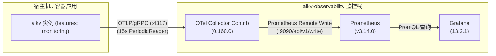

# AiKv 可观测性监控栈 (Observability Stack)

本目录提供面向 `aikv` 存储引擎与协议层的轻量级、免维护、安全默认的可观测性监控栈。内置 OpenTelemetry Collector、Prometheus 和 Grafana 三件套，自动挂载预置数据源与 3 张白盒性能分析大盘。

---

## 1. 架构总览



---

## 2. 构建关键前提 (⚠️ 重要)

- **宿主机直接运行前提**：
  若在宿主机直接通过 `cargo run` 或 `target/debug/aikv` 启动，**必须显式开启 `monitoring` feature**：
  ```bash
  cargo build -p aikv --features monitoring
  ```
  > **注意**：默认 feature 构建的 `aikv` 二进制**不会注册任何 OTel 指标**，无法将白盒度量推送至 Collector。
- **容器镜像**：
  `deploy/Dockerfile` 与 `deploy/Dockerfile.local` 镜像构建脚本已默认启用 `--features cluster,monitoring,compression`，容器镜像天然具备指标导出能力。

---

## 3. 快速上手

### 3.1 启动监控栈

```bash
cd deploy
./up-observability.sh
```

脚本将自动检测 Docker/Compose 环境、自 `deploy/.env.example` 复制默认环境变量、启动服务并执行 60 秒轮询探活。

- **Grafana 访问**：[http://127.0.0.1:3000](http://127.0.0.1:3000)（默认免密 Viewer 模式，管理员账号 `admin` / `admin`）
- **Prometheus 访问**：[http://127.0.0.1:9090](http://127.0.0.1:9090)
- **OTel 收集端点**：宿主机访问 `127.0.0.1:4317` (gRPC) / `127.0.0.1:4318` (HTTP)；同 Docker 网络容器原生 DNS 为 `http://aikv-otel-collector:4317`

### 3.2 停止监控栈

```bash
# 停止容器并保留历史监控数据卷 (prom-data, grafana-data)
docker compose --project-directory deploy/observability -f deploy/observability/docker-compose.yaml --env-file deploy/.env down

# 停止容器并彻底清空历史监控数据卷
docker compose --project-directory deploy/observability -f deploy/observability/docker-compose.yaml --env-file deploy/.env down -v
```

---

## 4. aikv 实例对接指南

启动 `aikv` 实例时，只需设置标准 OpenTelemetry 环境变量 `OTEL_EXPORTER_OTLP_ENDPOINT`：

```bash
export OTEL_EXPORTER_OTLP_ENDPOINT=http://127.0.0.1:4317

# 启动示例
./target/debug/aikv --engine aidb --data-dir /tmp/aikv-data --bind 127.0.0.1:6379
```

指标按 15 秒周期（OTel `PeriodicReader`）自动批量推送至 Collector。

---

## 5. 指标语义规范与对账契约

完整度量规范、计算公式与埋点定义详见底层文档：[`aidb/docs/metrics.md`](../../../aidb/docs/metrics.md)。

在 Grafana 曲线与 Redis `INFO` 面板之间对账时，遵循以下确定性契约：

| 观测维度 | Grafana PromQL 指标 | Redis INFO 对应字段 | 对账契约与口径 |
| --- | --- | --- | --- |
| **WAL 重放耗时** | `aidb_recovery_wal_replay_duration_seconds` | `INFO storage` -> `recovery_wal_replay_duration_us` | **OTel 秒 = INFO 微秒 × 10⁻⁶**；受 Reset 白名单保护常驻 |
| **WAL 重放物理字节** | `aidb_recovery_wal_replayed_bytes` | `INFO storage` -> `recovery_wal_replayed_bytes` | 物理字节量 **1:1 等价** (Gauge 规范无 `_total` 后缀) |
| **Manifest 恢复耗时** | `aidb_recovery_manifest_duration_seconds` | `INFO storage` -> `recovery_manifest_duration_us` | **OTel 秒 = INFO 微秒 × 10⁻⁶**；覆盖三大冷启动恢复分支 |
| **SST 打开耗时** | `aidb_recovery_sstable_open_duration_seconds` | `INFO storage` -> `recovery_sstable_open_duration_us` | **OTel 秒 = INFO 微秒 × 10⁻⁶**；全量 SSTable 校验耗时 |
| **键计数器重扫耗时** | `aikv_recovery_rebuild_counters_duration_seconds` | `INFO storage` -> `recovery_rebuild_counters_duration_us` | **OTel 秒 = INFO 微秒 × 10⁻⁶**；16 个 DB 全库键重建耗时 |
| **单次最大写停顿** | `aidb_write_stall_max_duration_seconds` | `INFO storage` -> `write_stall_max_duration_us` | **OTel 秒 = INFO 微秒 × 10⁻⁶**；生命周期内极值 |
| **系统 OS 线程数** | `aikv_process_threads` | `INFO threads` -> `process_threads` | 操作系统当前真实线程数 **1:1 等价** |
| **上下文切换速率** | `aikv_process_context_switches_total` | `INFO threads` -> 差分累加 | 差分速率曲线对应 INFO 字段累加差分速率 |

---

## 6. 预置监控大盘体系 (4 张预置大盘)

Grafana 启动后自动加载 `AiKv` 仪表盘目录下的四张大盘：

1. **`AiKv / 概览与基准评测 (Overview & Benchmark)` (推荐主盘)**：
   - **“3 个常驻展开 + 2 个专项折叠”工业级 5-Row 架构**：
     - **Row 1: 业务服务层 (Client 视角)**（常驻展开）：
       - 顶部 6 张核心 KPI 摘要卡 (w=4)：存活节点数、集群总 Key 数、SST 磁盘总占用、区间慢查询增量 (≥10 告警)、命令错误率 (ID 50, error 比率 %)、连接拒绝速率 (ID 51, ops/s)；
       - 三大时序黄金柱石 (8:8:8 宽幅并列)：总处理吞吐趋势 (OPS)、各命令吞吐时序拆解 (OPS by Commands)、端到端延迟分位数时序 (P50/P95/P99)；
       - 命令观测矩阵四联 (6:6:6:6)：命令调用量占比 (环形饼图)、命令执行量排行 (Top 10 Bar Gauge)、各业务命令响应延迟 P50 对比、键空间命中率时序 (真实命中率，无假健康)；全部命令面板严格过滤内部控制面伪命令；
       - 网络与连接状态监控 (8:8:8)：服务网络带宽 (双线: In/Out)、客户端连接/阻塞与拒绝 (三线)、慢查询速率 (全命令合计 vs 各命令分线)。
     - **Row 2: 存储引擎层 (LSM-Tree 视角)**（常驻展开）：
       - 三大核心状态摘要卡 (w=8)：写放大 (WA, 带 Sparkline 面积图)、读放大 (RA, 带 Sparkline)、空间放大 (SA, 基于 $payload_bytes 估算, 带 Sparkline)；
       - 写路径因果诊断区：物理写入速率分解 vs 用户逻辑写入基准 (ID 14, 堆叠物理写上叠独立逻辑写折线, 直读写放大)、Write Stall 写停顿频次与最大耗时 (ID 15 双轴)、MemTable 活跃/只读内存与 WAL 大小心跳 (ID 35)、Flush 与 Compaction 速率/P95 耗时双轴同屏 (ID 43)；
       - 读链路与缓存穿透区：Block Cache 命中率与 Miss 穿透速率 (ID 17 双轴)、读放大 (RA) 演进与 Bloom Filter 假阳性率联动 (ID 52 双轴带 1.0 基准线)；
       - LSM 空间形态与底层算子区：纯 SSTable 分层文件数堆叠 (ID 18, L0 高亮)、SSTable 分层占用与 Key 增长 (ID 36 彻底修复 Matcher 右轴纯数字绑定)、存储底层核心算子 P95 耗时分布 (ID 16 表格图例)。
     - **Row 3: 系统物理层 (OS & Host 视角)**（常驻展开）：
       - 顶部 4 张物理摘要卡 (w=6)：AiKv 实例 CPU 消耗核数 (ID 53)、进程物理驻留内存 RSS (ID 54)、OS 线程总数 (ID 55)、磁盘最大平均等待耗时 (ID 56 await ms，显式 `* 1000` 换算)；
       - 主机硬件 vs 进程资源对比区 (3 联 × w=8, h=7)：主机 CPU 利用率 vs AiKv 消耗核数 (用户态/内核态拆解)、主机物理内存分布 vs AiKv 驻留 RSS、主机磁盘读写带宽 + AiKv 进程自身真实读写吞吐 + await 等待耗时右轴印证；
       - 磁盘饱和度与内核调度区 (2 联 × w=12, h=7)：磁盘饱和度 (ID 57，左轴读写 IOPS，右轴 `%util` 显式 `* 100` 换算)、进程线程数 + 系统分配 FD (宿主机视角标注) + 自愿/非自愿上下文切换速率右轴。
     - **Row 4: 分布式与集群通信 (Cluster & HA)**（默认折叠，按需展开）：
       - 集群重定向速率 (ID 34, MOVED/ASK)、Gossip 心跳与故障转移速率 (ID 41, Failover 标红)、Raft 底层复制通信吞吐 (ID 42，按 RPC 类型与方向分解)。
     - **Row 5: 冷启动与崩溃恢复 (Cold Recovery & RTO)**（默认折叠，按需展开）：
       - 完整迁入并保留全部对账契约说明：5 张 RTO 阶段 Stat 卡片 (WAL 重放耗时与字节、Manifest 耗时、SST 打开耗时、全库键计数器重扫耗时)、WAL 重放吞吐带宽 (ID 65, Gauge)、RTO 4 阶段耗时构成占比 (ID 66, Timeseries)。全量注入 `$cluster/$host/$node` 模板变量。
   - **顶层变量级联联动与导航**：支持 `$cluster` (集群) -> `$host` (宿主机) -> `$node` (节点实例，支持多选与 All 聚合) 三级联动，并提供 `$payload_bytes` (单 Key 估算净载荷，默认 116B) 动态调整空间放大；内置 `tags: ["aikv-nav"]` 与全局面板下拉互跳链接；
   - **默认时间窗口与刷新**：默认 `now-30m` 到 `now`，`30s` 平衡刷新；所有 Timeseries 统一提供 `[mean, max]` 统计列；
   - **架构决策演进：拒绝「假健康」，建立生产级对账与排障契约**：
     - **淘汰假健康与 legacy 兜底**：全面剔除掩盖故障的 `vector(100)` 与无意义伪装，彻底清理 legacy `_ratio` 兜底与 `label_replace * 0` hack；
     - **Description 排障指引与对账契约**：在各面板内置标准 Description 说明，逐一列出「No data 常见原因」及「OTel 秒 = INFO 微秒 × 10⁻⁶」对账契约；
     - **折叠行节流**：Grafana 原生特性保证折叠状态的 Row 4 与 Row 5 不发起后台查询，兼顾单机极速压测与集群深度诊断。
2. **`AiKv - 存储引擎白盒指标 (Storage Engine)`**：
   - 写放大 (WA) 综合比率与 4 种写吞吐拆分曲线；
   - 读放大 (RA) 综合比率与 BlockCache 纯读命中率；
   - Write Stall 请求停顿百分比、停顿原因归因与 P99 停顿延迟分位数；
   - LSM 形态与 Compaction 积压量、各层 SST 文件与容量、Bloom 过滤器假阳性率 (FPR)。
3. **`AiKv - 冷启动恢复与 RTO 分析 (Cold Recovery & RTO)`**：
   - 5 项冷启动 RTO 耗时与字节 Stat 核心卡片；
   - WAL 物理重放带宽吞吐折线图；
   - RTO 4 阶段（Manifest、SST 打开、WAL 回放、计数器全库重扫）耗时构成对比图。
4. **`AiKv - 系统物理度量与协议概览 (Process & System)`**：
   - OS 线程总数、自愿/非自愿上下文切换速率曲线；
   - 物理 CPU 毫秒使用率换算；
   - 独立物理磁盘读写 I/O 双曲线；
   - 进程真实常驻内存 (RSS)；
   - 协议层命令 QPS、客户端连接与阻塞状态、Keyspace 命中率、网络吞吐。

---

## 7. 已知客户端 Trace 拒收警告说明 (文档化预期行为)

`aikv` 客户端默认通过统一 endpoint（`:4317`）同时上报 trace span 与 metrics。当前轻量级监控栈仅挂载了 metrics 流水线，未引入分布式追踪后端（如 Tempo）。

因此，`aikv` 实例在运行过程中控制台可能间歇性输出如下日志：
```text
OpenTelemetry trace error occurred. Exporting failed to send batch: status code 12 (Unimplemented)
```
**这是完全正常的文档化预期行为**，对 `aikv` 正常业务处理和 metrics 指标收集没有任何副作用。后续若需追踪 tracing，仅需在 `otel-collector/config.yaml` 增加 trace pipeline 并接入 Tempo 即可无缝启用。

---

## 8. OpenTelemetry 单位规范化与 Transform 策略 (架构决策)

- **现象与挑战**：
  OpenTelemetry Collector 0.160+ 默认开启了单位规范化（Unit Normalization）。当 Instrument 以无量纲单位 `with_unit("1")` 注册时（如 `aikv_process_threads`、`aidb_sstable_count`），Prometheus Remote Write Exporter 默认会将其视为 ratio 并追加 `_ratio` 后缀（导致仪表盘指标名漂移查无数据）。
- **全局选项 `add_metric_suffixes: false` 的副作用**：
  若在 Exporter 侧全局设置 `add_metric_suffixes: false`，会连带禁用 Histogram 直方图指标的 `_bucket`、`_sum`、`_count` 类型后缀，导致所有延迟分位数计算（如 Write Stall P99、命令耗时分布）的底层时序完全缺失。
- **最佳解法：Transform Processor**：
  在 Collector 管道中引入 `transform/strip_unit_one` 处理器：
  ```yaml
  processors:
    transform/strip_unit_one:
      metric_statements:
        - context: metric
          statements:
            - set(unit, "") where unit == "1"
  ```
  在导出前自动将无量纲 `unit="1"` 清空，既避免跨仓修改底层存储引擎代码，又同时实现了：
  1. Gauge 指标绝不产生 `_ratio` 后缀漂移；
  2. Histogram 直方图派生序列（`_bucket`、`_sum`、`_count`）100% 完整保留。
