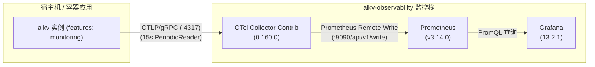

# AiKv 可观测性监控栈 (Observability Stack)

本目录提供面向 `aikv` 存储引擎与协议层的轻量级、免维护、安全默认的可观测性监控栈。内置 OpenTelemetry Collector、Prometheus 和 Grafana 三件套，自动挂载预置数据源与 3 张白盒性能分析大盘。

---

## 1. 架构总览



---

## 2. 构建关键前提 (⚠️ 重要)

- **宿主机直接运行前提**：
  若在宿主机直接通过 `cargo run` 或 `target/debug/aikv` 启动，**必须显式开启 `monitoring` feature**：
  ```bash
  cargo build -p aikv --features monitoring
  ```
  > **注意**：默认 feature 构建的 `aikv` 二进制**不会注册任何 OTel 指标**，无法将白盒度量推送至 Collector。
- **容器镜像**：
  `deploy/Dockerfile` 与 `deploy/Dockerfile.local` 镜像构建脚本已默认启用 `--features cluster,monitoring,compression`，容器镜像天然具备指标导出能力。

---

## 3. 快速上手

### 3.1 启动监控栈

```bash
cd deploy/observability
./up-observability.sh
```

脚本将自动检测 Docker/Compose 环境、自 `.env.example` 复制默认环境变量、启动服务并执行 60 秒轮询探活。

- **Grafana 访问**：[http://127.0.0.1:3000](http://127.0.0.1:3000)（默认免密 Viewer 模式，管理员账号 `admin` / `admin`）
- **Prometheus 访问**：[http://127.0.0.1:9090](http://127.0.0.1:9090)
- **OTel 收集端点**：`127.0.0.1:4317` (gRPC) / `127.0.0.1:4318` (HTTP)

### 3.2 停止监控栈

```bash
# 停止容器并保留历史监控数据卷 (prom-data, grafana-data)
./down-observability.sh

# 停止容器并彻底清空历史监控数据卷
./down-observability.sh --clean
```

---

## 4. aikv 实例对接指南

启动 `aikv` 实例时，只需设置标准 OpenTelemetry 环境变量 `OTEL_EXPORTER_OTLP_ENDPOINT`：

```bash
export OTEL_EXPORTER_OTLP_ENDPOINT=http://127.0.0.1:4317

# 启动示例
./target/debug/aikv --engine aidb --data-dir /tmp/aikv-data --bind 127.0.0.1:6379
```

指标按 15 秒周期（OTel `PeriodicReader`）自动批量推送至 Collector。

---

## 5. 指标语义规范与对账契约

完整度量规范、计算公式与埋点定义详见底层文档：[`aidb/docs/metrics.md`](../../../aidb/docs/metrics.md)。

在 Grafana 曲线与 Redis `INFO` 面板之间对账时，遵循以下确定性契约：

| 观测维度 | Grafana PromQL 指标 | Redis INFO 对应字段 | 对账契约与口径 |
| --- | --- | --- | --- |
| **WAL 重放耗时** | `aidb_recovery_wal_replay_duration_seconds` | `INFO storage` -> `recovery_wal_replay_duration_us` | **OTel 秒 = INFO 微秒 × 10⁻⁶**；受 Reset 白名单保护常驻 |
| **WAL 重放物理字节** | `aidb_recovery_wal_replayed_bytes` | `INFO storage` -> `recovery_wal_replayed_bytes` | 物理字节量 **1:1 等价** (Gauge 规范无 `_total` 后缀) |
| **Manifest 恢复耗时** | `aidb_recovery_manifest_duration_seconds` | `INFO storage` -> `recovery_manifest_duration_us` | **OTel 秒 = INFO 微秒 × 10⁻⁶**；覆盖三大冷启动恢复分支 |
| **SST 打开耗时** | `aidb_recovery_sstable_open_duration_seconds` | `INFO storage` -> `recovery_sstable_open_duration_us` | **OTel 秒 = INFO 微秒 × 10⁻⁶**；全量 SSTable 校验耗时 |
| **键计数器重扫耗时** | `aikv_recovery_rebuild_counters_duration_seconds` | `INFO storage` -> `recovery_rebuild_counters_duration_us` | **OTel 秒 = INFO 微秒 × 10⁻⁶**；16 个 DB 全库键重建耗时 |
| **单次最大写停顿** | `aidb_write_stall_max_duration_seconds` | `INFO storage` -> `write_stall_max_duration_us` | **OTel 秒 = INFO 微秒 × 10⁻⁶**；生命周期内极值 |
| **系统 OS 线程数** | `aikv_process_threads` | `INFO threads` -> `process_threads` | 操作系统当前真实线程数 **1:1 等价** |
| **上下文切换速率** | `aikv_process_context_switches_total` | `INFO threads` -> 差分累加 | 差分速率曲线对应 INFO 字段累加差分速率 |

---

## 6. 3 张专属预置大盘说明

Grafana 启动后自动加载 `AiKv` 仪表盘目录下的三张大盘：

1. **`AiKv - 存储引擎白盒指标 (Storage Engine)`**：
   - 写放大 (WA) 综合比率与 4 种写吞吐拆分曲线；
   - 读放大 (RA) 综合比率与 BlockCache 纯读命中率；
   - Write Stall 请求停顿百分比、停顿原因归因与 P99 停顿延迟分位数；
   - LSM 形态与 Compaction 积压量、各层 SST 文件与容量、Bloom 过滤器假阳性率 (FPR)。
2. **`AiKv - 冷启动恢复与 RTO 分析 (Cold Recovery & RTO)`**：
   - 5 项冷启动 RTO 耗时与字节 Stat 核心卡片；
   - WAL 物理重放带宽吞吐折线图；
   - RTO 4 阶段（Manifest、SST 打开、WAL 回放、计数器全库重扫）耗时构成对比图。
3. **`AiKv - 系统物理度量与协议概览 (Process & System)`**：
   - OS 线程总数、自愿/非自愿上下文切换速率曲线；
   - 物理 CPU 毫秒使用率换算；
   - 独立物理磁盘读写 I/O 双曲线；
   - 进程真实常驻内存 (RSS)；
   - 协议层命令 QPS、客户端连接与阻塞状态、Keyspace 命中率、网络吞吐。

---

## 7. 已知客户端 Trace 拒收警告说明 (文档化预期行为)

`aikv` 客户端默认通过统一 endpoint（`:4317`）同时上报 trace span 与 metrics。当前轻量级监控栈仅挂载了 metrics 流水线，未引入分布式追踪后端（如 Tempo）。

因此，`aikv` 实例在运行过程中控制台可能间歇性输出如下日志：
```text
OpenTelemetry trace error occurred. Exporting failed to send batch: status code 12 (Unimplemented)
```
**这是完全正常的文档化预期行为**，对 `aikv` 正常业务处理和 metrics 指标收集没有任何副作用。后续若需追踪 tracing，仅需在 `otel-collector/config.yaml` 增加 trace pipeline 并接入 Tempo 即可无缝启用。
