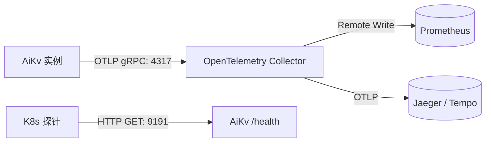

# AiKv 部署与运行

本文面向运维工程师与系统开发者, 说明 **如何构建 AiKv、配置 Cargo feature、运行单机与 Redis Cluster 分布式集群、配置 OTLP 监控告警以及执行持久化快照运维**.

---

## 1. 系统要求与硬件规划

| 资源维度             | 生产推荐配置                       | 最低运行要求                    | 运维与规划说明                                                 |
| ---------------- | ---------------------------- | ------------------------- | ------------------------------------------------------- |
| **Rust 工具链**     | Rust **stable**              | 声明于 `rust-toolchain.toml` | 包含 `clippy` 与 `rustfmt`                                 |
| **操作系统**         | Linux x86_64                  | 其他平台                   | Linux x86_64 正式支持, 其他平台 best-effort                  |
| **磁盘存储**         | 高性能 NVMe SSD                 | 标准 SSD                    | 持久化模式 (`--engine aidb`) 依赖磁盘顺序与随机 IOPS                  |
| **内存容量**         | 8 GiB ~ 64 GiB+              | 1 GiB                     | `memory` 引擎全驻留内存; `aidb` 引擎内存由 MemTable 与 BlockCache 决定 |
| **Protobuf 编译器** | `protoc` (最新 stable)         | 系统包管理器版本                  | 仅编译 `cluster` 特性时生成 Raft gRPC 桩代码需要                     |
| **网络端口规划**       | 独占 6379, 16379, 26379, 9191  | 见端口角色表                    | 集群模式单节点需规划 3 个互不冲突的通信端口                                 |

### 安全网络边界

AiKv v1 不内建 `AUTH`, `ACL` 或 `TLS`, 所有 RESP 连接默认使用明文 TCP. `RESP`, `MetaRaft` 和 `MultiRaft` 端口不得暴露到不可信网络. 需要跨越信任边界时, 必须使用认证/TLS proxy 或 service mesh, 并限制安全组, 防火墙和网络策略的来源.

示例中的监听地址应仅绑定到 loopback 或受控的私有网络. Metrics 和 health endpoint 也应按部署环境限制访问, 不应因为开启监控而直接暴露到不可信网络.

### Monorepo 依赖关系与本地 Patch

AiKv 依赖 GitHub `main` 分支上的 sibling 存储引擎 `aidb`. 本地协同开发时, 在 `~/.cargo/config.toml` 中配置 Git source 的本地覆盖:

```toml
[patch."https://github.com/wiqun/AiDb.git"]
aidb = { path = "/absolute/path/to/aidb" }
```

---

## 2. Cargo Features 构建矩阵

定义声明见 [Cargo.toml](../Cargo.toml):

| Feature       | 默认状态 | 包含模块与依赖                                              | 适用场景                      |
| ------------- | ---- | ---------------------------------------------------- | ------------------------- |
| **(none)**    | ❌（需 `--no-default-features`） | 极简单机 RESP 服务, 内存/单机 LSM 引擎                           | 无可选 feature 的最小二进制发布                   |
| `cluster`     | ❌    | `src/cluster/`, `ClusterDataAdapter`, `aidb/cluster` | Redis Cluster 分布式集群模式     |
| `monitoring`  | ❌    | `MetricsServer` (`/health` HTTP), OTel 指标/链路         | 生产环境 OTLP 监控接入与健康探活       |
| `compression` | ✅ 默认开启    | `aidb/compression` (Snap / LZ4 块压缩)                  | 默认使用 Snap; `--no-default-features` 可关闭 |

### 典型构建组合

```bash
# 1. 本地开发与 CI 门禁构建 (默认包含块压缩)
cargo build --release --features cluster

# 2. 生产环境标准镜像构建 (推荐全功能, 默认包含块压缩)
cargo build --release --features cluster,monitoring

# 3. 生产环境基础镜像构建 (无块压缩)
cargo build --release --no-default-features --features cluster,monitoring
```

---

## 3. 配置优先级

AiKv 采用四层配置合并, 优先级从低到高: **内置默认值 → TOML 文件 → 环境变量 → CLI**. 每层仅覆盖本层显式设置的字段; `Vec` 类型 (如 `cluster.peers`) 为全量替换, 非追加.

完整 TOML 结构、env 对照表、`ResolvedSettings` API 与 `ConfigWarning` 说明见 [09-config.md](modules/09-config.md).

### 3.1 配置文件发现

1. `--config <path>` 显式指定 (文件必须存在).
2. 未指定时依次尝试 `./aikv.toml` (cwd) → `/etc/aikv/aikv.toml`.
3. 均不存在 → 跳过文件层, 行为与纯 CLI 启动一致.

可复制模板: [`deploy/aikv.example.toml`](../deploy/aikv.example.toml).

### 3.3 容器化部署脚本

`deploy/` 目录提供基于 Docker 的一键部署脚本, 运行时配置由模板复制至 `deploy/.runtime/` (已加入 `.gitignore`):

```bash
./deploy/build-image.sh
./deploy/up-single.sh
./deploy/up-cluster.sh
./deploy/status.sh
./deploy/down.sh
```

- `up-single.sh`: 单机 aidb 模式, 使用 [`deploy/aikv.example.toml`](../deploy/aikv.example.toml) 中的容器路径与 Metrics 端口.
- `up-cluster.sh`: 启动 **6 个节点** 的 Redis Cluster 拓扑.
- 集群客户端入口: `redis-cli -c -p 6379` (智能客户端, 自动跟随 `-MOVED` / `-ASK` 重定向).

### 3.4 Docker 镜像来源与 Compose 拓扑

`deploy/Dockerfile` 是默认 GitHub `main` 构建, 使用 GitHub 上的 `aidb`;
`deploy/Dockerfile.local` 用于本地联调, 从 aikv 同层级的 `../aidb` 构建.
两者都生成同名 runtime image, 默认 tag 为 `aikv:dev`, 可通过
`AIKV_IMAGE` 覆盖. Compose 文件只引用已构建镜像, 不执行 build 或 pull.

推荐工作流:

```bash
./deploy/build-image.sh
./deploy/up-single.sh
./deploy/status.sh
./deploy/down.sh

./deploy/build-image.sh --local
./deploy/up-cluster.sh
./deploy/status.sh cluster
./deploy/down.sh cluster --purge
```

单机模式使用一个容器, 映射客户端 `6379` 和 Metrics `9191`, 数据卷名称为
`aikv`. 集群模式使用六个容器 (`aikv-1` 至 `aikv-6`): 两个分片, 每个分片
一个 master 和两个 replica. 为兼容现有本地 E2E 与 benchmark, 节点客户端端口为
`6379`, `6380`, `6381`, `7379`, `7380`, `7381`; 对应的 MetaRaft 端口为
`16379`, `16380`, `16381`, `17379`, `17380`, `17381`; MultiRaft 端口为
`26379`, `26380`, `26381`, `27379`, `27380`, `27381`; Metrics 端口仍为
`9191-9196`. 集群数据卷名称为 `aikv1-data` 至 `aikv6-data`.

启动脚本将基线模板复制到 `deploy/.runtime/`; 集群模式再为每个节点追加
`[cluster]` 配置. `up-cluster.sh` 启动时会移除同一 Compose project 中旧服务名
产生的 orphan 容器, 以避免升级后旧容器继续占用端口. 默认 `down.sh` 停止并移除
容器但保留 named volumes, 只有显式 `--purge` 才删除数据; 该快速部署参考不提供
旧卷到新卷的数据迁移. 如果 single 和 cluster 容器同时存在, `down.sh` 必须显式
指定模式以避免误删.

集群对外公布的 client 地址默认仍为 `127.0.0.1:<宿主客户端端口>`, 适合本机
`redis-cli -c -p 6379` 跟随 `MOVED` 重定向. 远程或跨主机访问时须同时设置:

- `AIKV_ANNOUNCE_IP`: 写入各节点 `client_addr` 与 `CLUSTER MEET` 的公布地址
  (出现在 `MOVED` / `CLUSTER NODES` 中);
- `AIKV_BIND_IP`: Compose 宿主机端口绑定地址, 默认 `127.0.0.1` (仅本机);
  对外暴露时设为 `0.0.0.0` 或具体网卡 IP.

二者职责分离: 绑定决定「谁能连上端口」, 公布决定「重定向告诉客户端去哪」.
只改绑定不改公布时, 外部客户端可连首节点, 但会收到指向 `127.0.0.1` 的
`MOVED` 而失败.

示例 (局域网单机六节点, 对外公布本机局域网 IP):

```bash
AIKV_BIND_IP=0.0.0.0 AIKV_ANNOUNCE_IP=192.168.1.112 ./deploy/up-cluster.sh
```

### 3.5 环境变量概要

除下表外, 全部 `AIKV_*` 与 TOML 路径一一对应, 详见 [09-config.md § 环境变量映射](modules/09-config.md#环境变量映射).

| 类别 | 代表变量 | 说明 |
| :--- | :--- | :--- |
| 服务 | `AIKV_BIND`, `AIKV_MAX_CLIENTS`, `AIKV_ENGINE`, `AIKV_DATA_DIR` | 对应 `[server]` / `[engine]` |
| 可观测 | `AIKV_JSON_LOG`, `AIKV_METRICS_ADDR`, `AIKV_OTLP_ENDPOINT` | 对应 `[observability]`; OTLP 端点 `OTEL_EXPORTER_OTLP_ENDPOINT` 优先于 `AIKV_OTLP_ENDPOINT` |
| 集群 | `AIKV_CLUSTER_NODE_ID`, `AIKV_CLUSTER_RPC_ADDR`, `AIKV_CLUSTER_PEERS` | 对应 `[cluster]`; peers 逗号分隔 |
| 已有 env | `AIKV_CLIENT_ADDR`, `AIKV_CLUSTER_ANNOUNCE_MODE`, `AIKV_LINEARIZABLE_READ` | 名称不变, 纳入 env 层 merge; `AIKV_LINEARIZABLE_READ` 仅 `1`/大小写不敏感的 `true` 为真, 其他值均为假 |
| 部署脚本 | `AIKV_BIND_IP`, `AIKV_ANNOUNCE_IP`, `AIKV_IMAGE`, `AIKV_CLUSTER_TIMEOUT_SECONDS` | 仅 `deploy/` Compose / `up-*.sh` 使用, 不进入进程四层配置 merge |
| 日志 | `RUST_LOG` | 仅 env, 不参与四层 merge struct |

`--print-config` 可将合并后有效配置以 TOML 格式输出到 stdout (然后继续启动), 便于排查优先级.

一般 AiKv 布尔环境变量采用宽松解析, 无法识别或空字符串会跳过并继承下层配置. `AIKV_LINEARIZABLE_READ` 为 legacy 兼容例外: key 存在即覆盖 TOML 层, 只有 `1` 或大小写不敏感的 `true` 表示真, 空字符串、`0`、`false` 及其他值均表示假. 该例外不改变整体 TOML → env → CLI 优先级.

### 3.6 交互式加压工具 (loadgen)

`deploy/loadgen/` 提供 Rust 独立 crate 的交互式加压工具: 对单机或集群持续加压,
浏览器单页控制台设完参数后点启动, **不记录任何统计结果** (观测走 §7 监控栈).

```bash
./deploy/loadgen/up.sh              # 默认 cluster, 入口 127.0.0.1:6379, 控制台 http://127.0.0.1:8787
./deploy/loadgen/up.sh --mode single
./deploy/loadgen/status.sh
./deploy/loadgen/down.sh
```

- crate 为独立 workspace, 不参与 `aikv` 的 `cargo test --workspace`; 门禁: `./deploy/loadgen/build.sh --check`.
- 探活间隔 30s; 启动前检查 seed / 集群状态, 运行中全挂或 CLUSTERDOWN 时暂停派发.
- 改表单不影响正在跑的任务; 只有点启动才按当前表单开新任务 (已在跑则先停再起).
- 运行时文件 (pid/log) 位于 `deploy/.runtime/loadgen/` (已 gitignore).
- 控制台无鉴权, 仅限本机/可信网段使用.

---

## 4. 命令行参数与环境变量

### 4.1 命令行参数 (`Cli`)

权威定义位于 [`src/config/cli.rs`](../src/config/cli.rs), 由 `main.rs` 调用 `config::resolve()`:

| 参数项                           | 默认值                 | 依赖 Feature / 引擎       | 说明                                                  |
| ----------------------------- | ------------------- | --------------------- | --------------------------------------------------- |
| `--config`                    | —                   | 始终有效                  | 显式 TOML 配置文件路径                                      |
| `--print-config`              | `false`             | 始终有效                  | 合并后配置打印到 stdout (TOML), 然后继续启动                      |
| `--bind`                      | `127.0.0.1:6379`    | 始终有效                  | RESP 客户端 TCP 监听地址 (`host:port`)                     |
| `--engine`                    | `memory`            | 始终有效                  | 存储引擎类型: `memory` (开发测试) | `aidb` (生产推荐)             |
| `--data-dir`                  | —                   | `aidb` / `cluster` 必填 | 数据持久化与 WAL 存放根目录                                    |
| `--sync-wal`                  | 未传不覆盖, 最终 `false` | `aidb` / `cluster`    | 裸 flag 开启; 也支持 `--sync-wal=false`; 是否每条写操作强制 fsync WAL (强持久, 吞吐下降) |
| `--aidb-preset`               | `default`           | `aidb`                | LSM 参数预设: `default` | `high-write` | `high-read`    |
| `--backup-dir`                | `{data_dir}/backup` | 可选                    | `SAVE` / `BGSAVE` Checkpoint 快照输出目录                 |
| `--cluster-node-id`           | —                   | `cluster`             | 当前节点的唯一 u64 节点 ID                                   |
| `--cluster-rpc-addr`          | —                   | `cluster`             | MetaRaft 控制面 gRPC 监听地址 (`host:port`)                |
| `--cluster-peers`             | `[]`                | `cluster`             | 集群已知节点 RPC 列表 (逗号分隔; 空表示引导节点)                       |
| `--raft-election-timeout-min` | `1000`              | `cluster`             | Raft 最小选举超时 (毫秒)                                    |
| `--raft-election-timeout-max` | `2000`              | `cluster`             | Raft 最大选举超时 (毫秒)                                    |
| `--raft-rpc-timeout-ms`       | `500`               | `cluster`             | Raft RPC 请求超时 (毫秒, 须小于最小选举超时)                       |
| `--raft-heartbeat-interval`   | `300`               | `cluster`             | Raft Leader 心跳间隔 (毫秒)                               |
| `--lifecycle-tick-ms`         | `1000`              | `cluster`             | LifecycleManager 生命周期巡检周期 (毫秒)                      |
| `--gossip-interval`           | `1`                 | `cluster`             | 拓扑轻量刷新与 Gossip 指标周期 (秒)                             |
| `--config-auto-save-ms`       | `2000`              | `cluster`             | 集群节点拓扑状态自动持久化间隔 (毫秒)                                |
| `--cluster-data-port-offset`  | `10000`             | `cluster`             | MultiRaft 数据面端口偏移 (`data_port = rpc_port + offset`) |
| `--metrics-addr`              | `127.0.0.1`         | CLI 始终有效              | HTTP 探活监听 IP (仅在 `monitoring` 生效)                   |
| `--metrics-port`              | `9191`              | CLI 始终有效              | HTTP 探活监听端口 (仅在 `monitoring` 生效)                    |
| `--max-clients`               | `10000`             | 始终有效                  | 最大并发客户端连接数 (`0` 表示无限制)                              |

> **集群模式启动门控**: 仅当 `--cluster-node-id` **与** `--cluster-rpc-addr` **同时提供** 时才会初始化集群状态机; 仅提供其一将退化为单机模式运行.

### 4.2 环境变量配置 (业界惯例与 OTel)

以下变量保留业界惯例名, 不参与 TOML struct; 完整 `AIKV_*` 对照见 [09-config.md](modules/09-config.md).

| 环境变量                          | 默认值       | 作用说明                                                          |
| ----------------------------- | --------- | ------------------------------------------------------------- |
| `RUST_LOG`                    | `info`    | Tracing 日志级别过滤指令 (不参与四层 merge)                              |
| `AIKV_JSON_LOG`               | `true`    | 是否以 JSON 格式输出结构化日志; 亦可写 TOML `observability.json_log`          |
| `OTEL_EXPORTER_OTLP_ENDPOINT` | 空 (跳过)    | OTLP gRPC 端点; 优先于 `AIKV_OTLP_ENDPOINT`                         |
| `OTEL_SERVICE_NAME`           | `aikv`    | OTel 服务名; 优先于 `AIKV_OTEL_SERVICE_NAME`                        |
| `OTEL_DEPLOYMENT_ENVIRONMENT` | 空         | 部署环境; 优先于 `AIKV_DEPLOYMENT_ENV`                                |
| `AIKV_CLIENT_ADDR`            | 自动推导      | 集群客户端通告地址 (对应 `cluster.client_addr`)                         |
| `AIKV_CLUSTER_ANNOUNCE_MODE`  | `unknown` | 通告模式: `unknown` | `fixed`                                   |
| `AIKV_OTEL_SAMPLE_RATIO`      | `1.0`     | 链路追踪采样率 (`0.0` ~ `1.0`)                                       |


---

## 5. 单机部署实践

### 5.1 内存引擎模式 (仅限开发与集成测试)

```bash
cargo run --release --features cluster -- \
  --bind 127.0.0.1:6379 \
  --engine memory
```

### 5.2 AiDb 引擎模式 (单机生产持久化)

```bash
mkdir -p /var/lib/aikv/data

cargo run --release --features cluster,monitoring -- \
  --bind 127.0.0.1:6379 \
  --engine aidb \
  --data-dir /var/lib/aikv/data \
  --aidb-preset high-write \
  --metrics-addr 127.0.0.1 \
  --metrics-port 9191
```

**连接与验证**:

```bash
# 1. RESP 验证
redis-cli -h 127.0.0.1 -p 6379 PING
redis-cli -h 127.0.0.1 -p 6379 SET mykey "hello world"
redis-cli -h 127.0.0.1 -p 6379 GET mykey

# 2. HTTP 探活验证
curl -s http://127.0.0.1:9191/health
```

---

## 6. Redis Cluster 分布式集群部署

### 6.1 节点端口角色规划

每个集群节点在物理机或容器上需要分配 **3 个端口角色**:

```
[Client (redis-cli -c)] ---> 6379  (RESP Client Port: --bind)
[MetaRaft Leader/Peer]  ---> 16379 (MetaRaft Control Port: --cluster-rpc-addr)
[MultiRaft Data Shard]  ---> 26379 (MultiRaft Data Port: rpc_port + offset 10000)
```

> **约束**: 保证 `rpc_port + offset ≤ 65535`, 全集群所有节点的 `--cluster-data-port-offset` 必须严格一致.

### 6.2 三节点集群启动示例

**节点 1 (Bootstrap 引导节点)**:

```bash
cargo run --release --features cluster,monitoring -- \
  --bind 127.0.0.1:6379 \
  --engine aidb --data-dir /var/lib/aikv/node1 \
  --cluster-node-id 1 \
  --cluster-rpc-addr 127.0.0.1:16379 \
  --metrics-port 9191
```

**节点 2 (加入节点)**:

```bash
cargo run --release --features cluster,monitoring -- \
  --bind 127.0.0.1:6380 \
  --engine aidb --data-dir /var/lib/aikv/node2 \
  --cluster-node-id 2 \
  --cluster-rpc-addr 127.0.0.1:16380 \
  --cluster-peers 127.0.0.1:16379 \
  --metrics-port 9192
```

**节点 3 (加入节点)**:

```bash
cargo run --release --features cluster,monitoring -- \
  --bind 127.0.0.1:6381 \
  --engine aidb --data-dir /var/lib/aikv/node3 \
  --cluster-node-id 3 \
  --cluster-rpc-addr 127.0.0.1:16381 \
  --cluster-peers 127.0.0.1:16379 \
  --metrics-port 9193
```

### 6.3 集群拓扑初始化与槽位分配

通过标准 `redis-cli` 执行初始化:

```bash
# 1. 节点握手 (第三参数指定 MetaRaft RPC 端口)
redis-cli -p 6379 CLUSTER MEET 127.0.0.1 6380 16380
redis-cli -p 6379 CLUSTER MEET 127.0.0.1 6381 16381
sleep 2

# 2. 检查节点拓扑
redis-cli -p 6379 CLUSTER NODES

# 3. 分配 16384 个槽位 (3 主节点平均分配)
redis-cli -p 6379 CLUSTER ADDSLOTS $(seq 0 5460)
redis-cli -p 6380 CLUSTER ADDSLOTS $(seq 5461 10922)
redis-cli -p 6381 CLUSTER ADDSLOTS $(seq 10923 16383)

# 4. 验证集群状态
redis-cli -p 6379 CLUSTER INFO # 应输出 cluster_state:ok
```

### 6.4 智能客户端访问 (Smart Client)

由于 AiKv 不做服务端透明转发, **客户端必须使用集群模式连接**:

```bash
redis-cli -c -p 6379
```

当客户端请求的 Key 处于其他节点分配的槽位时, 服务端将返回 `-MOVED <slot> <target_addr>`, 由智能客户端自动更新本地路由缓存并向目标节点重试.

---

## 7. 监控与可观测性接入运维

### 7.1 架构与导出机制



1. **编译要求**: 必须启用 `--features monitoring`;
2. **端点配置**: 设置 `OTEL_EXPORTER_OTLP_ENDPOINT=http://<collector_host>:4317`;
3. **健康探针**: Kubernetes Liveness / Readiness 探针配置 `http://<aikv_ip>:9191/health`;
4. **日志输出**: 结构化 JSON 日志通过标准错误输出由 Fluentbit / Vector 收集至 Loki; 标准输出可专用于 `--print-config` 的 TOML.

### 7.2 关键生产监控告警指标


| 告警指标项        | 指标名                                   | 关注阈值与排查建议                         |
| ------------ | ------------------------------------- | --------------------------------- |
| **连接数过载**    | `aikv_connected_clients`              | 达到 `--max-clients` 的 80% 时预警连接池泄漏 |
| **命令错误率突增**  | `aikv_commands_total{status="error"}` | 非预期的 WRONGTYPE 或协议错误突增            |
| **P99 延迟劣化** | `aikv_command_duration_seconds`       | 关注 LSM Compaction 阻塞或磁盘 IO 瓶颈     |
| **慢查询激增**    | `aikv_slow_queries_total`             | 业务大 Key 扫描或复杂 Lua 脚本执行            |
| **集群重定向异常**  | `aikv_cluster_redirects_total`        | 客户端未开启 Cluster 模式或槽位迁移期间短暂升高      |
| **主从切换事件**   | `aikv_failover_total`                 | 发生非预期的 Raft Leader 重新选举           |
| **阻塞连接堆积**   | `aikv_blocked_clients`                | `BLPOP` / `BRPOP` 等待队列异常堆积        |


全部 `aikv_*` 指标全量清单参考 [08-observability-reference.md](modules/08-observability-reference.md).

---

## 8. 持久化与快照运维

- 持久化仅在 `--engine aidb` 模式下生效;
- `SAVE` / `BGSAVE` 基于 AiDb 的硬链接 Checkpoint 实现秒级一致性快照, 默认保存在 `{data_dir}/backup/` 目录下;
- 快照目录包含一致性 SSTable 硬链接与 MANIFEST 元数据, 可直接拷贝用于离线灾备与数据恢复.

```bash
# 触发后台快照
redis-cli -p 6379 BGSAVE

# 查询最后一次快照成功时间戳
redis-cli -p 6379 LASTSAVE
```

### 8.1 v1 升级边界

从 v1 之前版本升级到 v1.0.0 时, 数据目录, `DUMP`, Raft snapshot 和已有集群均不可原地升级或滚动升级. 不得在同一集群中混用不同版本节点, 也不得直接复用未经验证的旧持久化产物.

请先停止旧部署并保留可恢复备份, 再创建新部署, 按经过验证的迁移或恢复方案导入数据, 最后执行读写和集群健康检查. 若迁移方案不能验证数据完整性, 不应继续升级.
