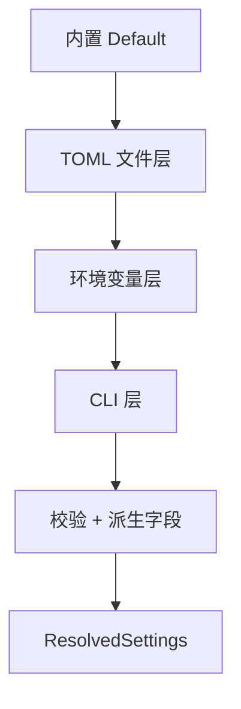

# AiKv Config (配置分层与优先级)

## 何时读本文

- 修改 `src/config/` 源码或 `main.rs` 配置加载 / `init_logging` 时序;
- 新增可配置项 (TOML 段、env 映射、CLI flag) 或调整 merge / 校验规则;
- 排查「为何最终生效值与预期不符」的优先级问题;
- **不覆盖**: TCP 连接与 `ServerSharedState` 运行时状态 → [02-server.md](02-server.md);
- **不覆盖**: OTel 指标导出实现细节 → [07-observability.md](07-observability.md);
- **不覆盖**: 集群拓扑与 announce 业务逻辑 → [06-cluster.md](06-cluster.md).

---

## 代码地图

```shell
src/config/
├── mod.rs       # 公开 API: resolve, resolve_from_parts, print
├── settings.rs  # Settings / ResolvedSettings, merge, into_resolved, ConfigWarning
├── file.rs      # TOML 加载, discover_config_path(_in)
├── env.rs       # AIKV_* / OTEL_* 覆盖
├── cli.rs       # Cli / CliOverrides (全 Option, 无 default_value)
└── engine.rs    # EngineKind (memory | aidb)
```

| 文件 | 核心职责 | 公共入口 |
| :--- | :--- | :--- |
| [`src/config/mod.rs`](../../src/config/mod.rs) | 运行时 `resolve()` 与测试 seam `resolve_from_parts()` | `resolve`, `resolve_from_parts` |
| [`src/config/settings.rs`](../../src/config/settings.rs) | 中间态 `Settings` 与最终态 `ResolvedSettings` | `Settings::merge_*`, `into_resolved`, `print_resolved_config` |
| [`src/config/file.rs`](../../src/config/file.rs) | 配置文件发现与 TOML 反序列化 | `discover_config_path`, `discover_config_path_in`, `load_settings_from_file` |
| [`src/config/env.rs`](../../src/config/env.rs) | 环境变量层 merge (注入式, 可单测, 返回非 fatal warnings) | `Settings::merge_env` |
| [`src/config/cli.rs`](../../src/config/cli.rs) | clap 解析; 仅显式 flag 覆盖下层 | `Cli`, `CliOverrides` |

---

## 四层优先级

合并顺序 (低 → 高, 高层覆盖低层 **显式提供的字段**):



**规则**:

1. 每层只覆盖本层显式设置的字段; 未设置则继承下层.
2. **`Vec` 类型 (如 `cluster.peers`) 为全量替换 (Replace), 非追加.**
3. TOML 解析失败 → 启动失败, 错误含文件路径与字段.
4. 找不到配置文件 → 跳过文件层, 非错误.
5. 合并完成后 `tracing::info!`: 实际使用的配置文件路径, 或 `config file: none`.

### 配置文件发现顺序

1. `--config <path>` 显式指定 (文件必须存在, 否则 fatal).
2. 未指定时依次尝试:
   - `./aikv.toml` (进程 cwd)
   - `/etc/aikv/aikv.toml`
3. 均不存在 → 跳过文件层.

`discover_config_path_in(search_dir, explicit)` 供单测注入目录; 生产路径用 `discover_config_path()`.

### TOML 约定

- 分段 `[server]` / `[engine]` / `[observability]` / `[cluster]`, snake_case 键名.
- 支持部分配置 (仅写需改动的项).
- 已知 section 内 **未知键拒绝** (`deny_unknown_fields`), typo 会 fatal.
- 未开 `cluster` feature 时 `[cluster]` 捕获为 `Option<toml::Value>`, 合并后 emit `ConfigWarning::ClusterSectionIgnored`, 不 fatal.

示例模板: [`deploy/aikv.example.toml`](../../deploy/aikv.example.toml). 容器化部署脚本见 [deployment.md § 3.3](../deployment.md#33-容器化部署脚本).

### 容器化部署配置

`deploy/aikv.example.toml` 是单机基线模板, 不包含 `[cluster]` 段.
`aikv-single.sh up` 将它复制到 `deploy/.runtime/single/aikv.toml` 后挂载到容器;
`aikv-cluster.sh up` 为 `node1` 至 `node6` 分别复制模板并追加 `[cluster]`, 写入
唯一的 `node_id`、Docker service RPC 地址、宿主机 client 地址和
`cluster_data_port_offset = 10000`.

单机使用一个容器, client/Metrics 端口为 `6379/9191`, named volume 为 `aikv`.
集群使用六个容器 `aikv-1` 至 `aikv-6`, 宿主机 client 端口依次为
`6379`, `6380`, `6381`, `7379`, `7380`, `7381`, Metrics 端口为 `9191-9196`;
MetaRaft 端口依次为 `16379`, `16380`, `16381`, `17379`, `17380`, `17381`,
MultiRaft 端口依次为 `26379`, `26380`, `26381`, `27379`, `27380`, `27381`.
集群数据卷为 `aikv1-data` 至 `aikv6-data`. 容器内每个节点的监听端口与其
宿主机映射端口一致. 集群配置的 `announce_mode = "fixed"` 默认公布
`127.0.0.1:<宿主机 client 端口>`; 本机客户端应使用 `redis-cli -c -p 6379`
跟随 `MOVED` 重定向. 远程访问时由 `aikv-cluster.sh up -a/--announce` 覆盖公布地址,
并由 `-b/--bind` (默认 `127.0.0.1`, 环境变量 `AIKV_BIND_IP`) 控制宿主机
端口绑定; 详见 [deployment.md § 容器化部署](../deployment.md).

---

## 环境变量映射

服务配置统一 `AIKV_*` 扁平命名; `[server]` / `[engine]` 段可省略段前缀.

| TOML 路径 | 环境变量 | CLI |
| :--- | :--- | :--- |
| `server.bind` | `AIKV_BIND` | `--bind` |
| `server.max_clients` | `AIKV_MAX_CLIENTS` | `--max-clients` |
| `engine.kind` | `AIKV_ENGINE` | `--engine` |
| `engine.data_dir` | `AIKV_DATA_DIR` | `--data-dir` |
| `engine.sync_wal` | `AIKV_SYNC_WAL` | `--sync-wal` |
| `engine.aidb_preset` | `AIKV_AIDB_PRESET` | `--aidb-preset` |
| `engine.backup_dir` | `AIKV_BACKUP_DIR` | `--backup-dir` |
| `observability.metrics_addr` | `AIKV_METRICS_ADDR` | `--metrics-addr` |
| `observability.metrics_port` | `AIKV_METRICS_PORT` | `--metrics-port` |
| `observability.json_log` | `AIKV_JSON_LOG` | (仅 env/TOML) |
| `observability.otlp_endpoint` | `AIKV_OTLP_ENDPOINT` | (仅 env/TOML) |
| `observability.otel_service_name` | `AIKV_OTEL_SERVICE_NAME` | (仅 env/TOML) |
| `observability.otel_sample_ratio` | `AIKV_OTEL_SAMPLE_RATIO` | (仅 env/TOML) |
| `observability.host_label` | `AIKV_HOST_LABEL` | (仅 env/TOML) |
| `observability.deployment_env` | `AIKV_DEPLOYMENT_ENV` | (仅 env/TOML) |
| `cluster.node_id` | `AIKV_CLUSTER_NODE_ID` | `--cluster-node-id` |
| `cluster.rpc_addr` | `AIKV_CLUSTER_RPC_ADDR` | `--cluster-rpc-addr` |
| `cluster.peers` | `AIKV_CLUSTER_PEERS` | `--cluster-peers` (逗号分隔) |
| `cluster.raft_election_timeout_min` | `AIKV_RAFT_ELECTION_TIMEOUT_MIN` | `--raft-election-timeout-min` |
| `cluster.raft_election_timeout_max` | `AIKV_RAFT_ELECTION_TIMEOUT_MAX` | `--raft-election-timeout-max` |
| `cluster.raft_rpc_timeout_ms` | `AIKV_RAFT_RPC_TIMEOUT_MS` | `--raft-rpc-timeout-ms` |
| `cluster.meta_rpc_timeout_ms` | `AIKV_META_RPC_TIMEOUT_MS` | `--meta-rpc-timeout-ms` |
| `cluster.raft_heartbeat_interval` | `AIKV_RAFT_HEARTBEAT_INTERVAL` | `--raft-heartbeat-interval` |
| `cluster.lifecycle_tick_ms` | `AIKV_LIFECYCLE_TICK_MS` | `--lifecycle-tick-ms` |
| `cluster.gossip_interval` | `AIKV_GOSSIP_INTERVAL` | `--gossip-interval` |
| `cluster.config_auto_save_ms` | `AIKV_CONFIG_AUTO_SAVE_MS` | `--config-auto-save-ms` |
| `cluster.cluster_data_port_offset` | `AIKV_CLUSTER_DATA_PORT_OFFSET` | `--cluster-data-port-offset` |
| `cluster.client_addr` | `AIKV_CLIENT_ADDR` | (已有 env) |
| `cluster.announce_mode` | `AIKV_CLUSTER_ANNOUNCE_MODE` | (已有 env) |
| `cluster.linearizable_read` | `AIKV_LINEARIZABLE_READ` | (已有 env) |

### 业界惯例 env (不进 TOML struct)

| 变量 | 作用 | 与 AIKV_* 关系 |
| :--- | :--- | :--- |
| `RUST_LOG` | tracing 级别 | 仅 env, 不参与四层 merge |
| `OTEL_EXPORTER_OTLP_ENDPOINT` | OTLP 端点 | 优先于 `AIKV_OTLP_ENDPOINT` |
| `OTEL_SERVICE_NAME` | 服务名 | 优先于 `AIKV_OTEL_SERVICE_NAME` |
| `OTEL_DEPLOYMENT_ENVIRONMENT` | 部署环境 | 优先于 `AIKV_DEPLOYMENT_ENV` |
| `OTEL_RESOURCE_ATTRIBUTES` | 额外 resource 标签 | 仅 env (逗号 `key=value`) |
| `AIKV_NODE_ID` | OTel resource node id | 回落到 `cluster.node_id` |

一般 `AIKV_*` 布尔 env 的空字符串视为 **未设置**, 并采用宽松解析 (`1`/`true`/`yes`/`on` 等为真, `0`/`false`/`no`/`off` 等为假); 无法识别则跳过, 继承下层. `AIKV_LINEARIZABLE_READ` 是为兼容旧版而保留的例外: 只要 key 存在就显式覆盖环境变量层, 仅值 `1` 或大小写不敏感的 `true` 为真, 其他值 (包括空字符串、`0`、`false`、`maybe`、`2`) 均为假. 该例外只改变 env 层解析, 不改变整体 TOML → env → CLI 合并顺序.

---

## 公开 API

### 运行时入口

```rust
pub fn resolve(cli: &Cli) -> ResolveResult;
```

流程: `discover_config_path` → `load_settings_from_file` → `merge_env(std::env::vars())` (收集 env 层 warnings) → `merge_cli` → `into_resolved` (补充校验 warnings).

### 测试 seam

```rust
pub fn resolve_from_parts(
    toml_inline: Option<&str>,
    env: impl IntoIterator<Item = (String, String)>,
    cli: &CliOverrides,
) -> ResolveResult;
```

- **运行时**: env 来自 `std::env::vars()`.
- **单元测试**: 构造内存 `HashMap`, **禁止** `std::env::set_var` (多线程不安全).
- 集成测试: `tests/config_priority.rs` (`//! @component aikv-config`), 子进程 `--print-config` smoke.

### CLI 新增 flag

| Flag | 说明 |
| :--- | :--- |
| `--config <path>` | 显式 TOML 路径 |
| `--print-config` | 合并后 TOML 打印到 **stdout**, 然后继续正常启动 |

`CliOverrides` 字段均为 `Option`, **不设** clap `default_value`; 仅 `Some(v)` 覆盖下层. 其中 `--sync-wal` 支持可选值: 未传时为 `None`, 裸 `--sync-wal` 为 `Some(true)`, `--sync-wal=false` 为 `Some(false)`.

### `--print-config` 输出

- 有效配置 → **stdout** (便于 `aikv --print-config > actual.toml`).
- tracing / 服务日志 → **stderr**.

---

## ResolvedSettings 与消费方

`ResolvedSettings` 为扁平最终配置 (业务字段无 `Option`, 除 `backup_dir` / `data_dir` 等真正可选项).

| 消费方 | 读取字段 |
| :--- | :--- |
| `main.rs` | `bind`, `engine`, `data_dir`, `cluster.*`, `observability` |
| `init_logging` | `observability.json_log` |
| `server/otel.rs` | `otel_config_from_settings(&ResolvedObservability, ...)` |
| `cluster/announce.rs` | `ResolvedCluster.announce_mode`, `client_addr` |

**派生字段** (不单独配置):

- `backup_dir`: 未设且 `engine=aidb` → `{data_dir}/backup`.
- OTel `node_id`: `AIKV_NODE_ID` → `cluster.node_id` → None.

---

## 校验与 ConfigWarning

### Fatal 错误 (`ConfigError`)

| 规则 | 说明 |
| :--- | :--- |
| TOML 语法 / 未知键 / 类型错误 | `config error: file <path>: ...` |
| `--config` 指向不存在文件 | `config error: file ...: file not found` |
| `engine=aidb` 且无 `data_dir` | `validation engine.data_dir` |
| 集群启用且 `engine != aidb` | `validation engine.kind` |
| 集群启用且无 `data_dir` | `validation engine.data_dir` (现有 aidb 规则, 不另写检查) |
| `raft_rpc_timeout_ms >= raft_election_timeout_min` | validation |
| `raft_heartbeat_interval >= raft_election_timeout_min` | validation |

### 非 fatal 警告 (`ConfigWarning`)

合并阶段收集, **`init_logging` 之后** 由 main 统一 `tracing::warn!(target = "aikv::config", ...)`:

| 变体 | 触发条件 | 行为 |
| :--- | :--- | :--- |
| `UnknownAidbPreset { raw }` | 非法 preset 字符串 | 回退 `default` |
| `UnknownAnnounceMode { raw }` | 非法 announce_mode | 回退 `unknown` |
| `InvalidOtelSampleRatio { raw }` | 非 [0,1] 有限值 | 回退 `1.0` |
| `ClusterSectionIgnored` | 无 cluster feature 但 TOML 含 `[cluster]` | 忽略该段 |
| `PartialClusterConfig` | 仅配 `node_id` 或 `rpc_addr` 其一 | 退化为单机 |
| `MemoryEngineProductionHint` | `engine=memory` | 提示生产慎用 |

**集群门控**: 仅当 `cluster_node_id` **与** `cluster_rpc_addr` **同时有值** 时进入集群模式. 集群启用时 `engine` 必须为 `aidb` 且必须设置 `data_dir`; `memory` 仅用于单机. 只配其一仍为 `PartialClusterConfig`, 不进入集群.

---

## 关键 Invariants (勿破坏)

- **CLI 显式检测**: 禁止用 clap `default_value` 填充后再 merge, 会把「未传参」误判为用户指定.
- **Vec Replace**: 较高层显式指定 peers 等列表时整表替换, 不与下层合并.
- **Warning 时序**: 解析阶段 non-fatal 问题只入 `Vec<ConfigWarning>`, 不用 `eprintln!`; 保证 JSON 日志格式一致.
- **零破坏兼容**: 无配置文件、无 env、纯 CLI 启动行为与旧版一致; 现有 `AIKV_*` env 名与 CLI flag 不变.

---

## 测试 seam 速查

| 层级 | 测试位置 | 覆盖点 |
| :--- | :--- | :--- |
| 单元 | `src/config/mod.rs` (`resolve_tests`) | 四层优先级, CLI 未传不覆盖, env 空串, OTEL precedence |
| 单元 | `src/config/env.rs`, `cli.rs`, `file.rs` | 各 merge 函数边界 |
| 单元 | `src/config/settings.rs` | defaults golden (`into_resolved`) |
| 集成 | `tests/modules/config/priority.rs` | 子进程 `--print-config` stdout 无 tracing 混入 |

运行: `cargo test config_priority --features cluster,monitoring -- --test-threads=1`
